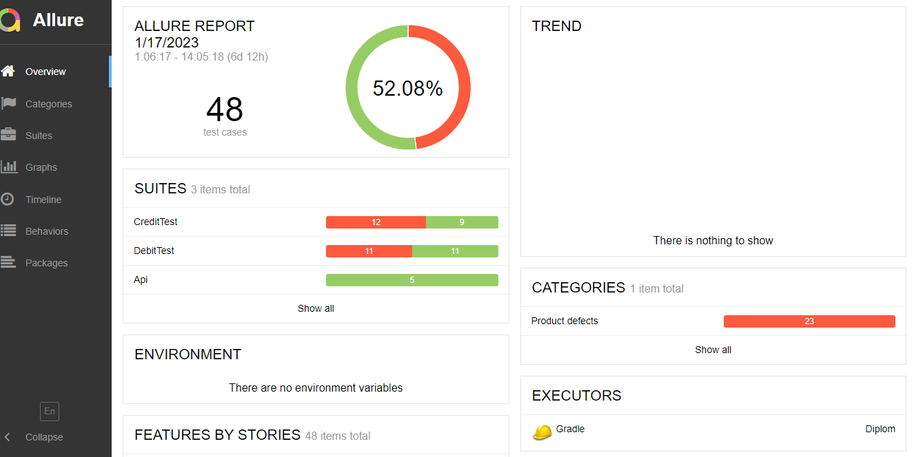
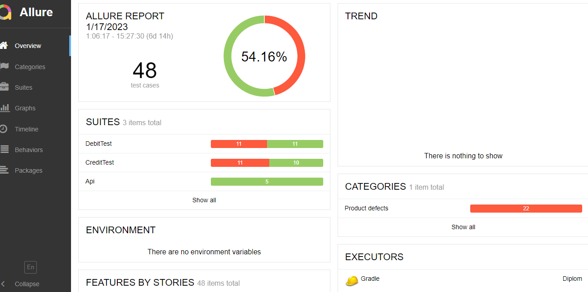

## Отчет по итогам тестирования

По результатам проведенного автоматизированного тестирования веб - сервиса "Путишествие дня",
общее количество проведенных тестов для каждой СУБД 48 из них:
* по форме "Оплата по Карте" - 21,
* по форме "Кредит по данным карты"- 21,
* Api тестов - 5
 

При подключении к СУБД MYSQL:
* Успешно пройденных тестов 54,16%

При подключении к СУБД PostgreSQL:
* Успешно пройденных тестов 54,16%

###Рекомендации
1. Исправить ошибку в название тура "Марракэш" на "Марракеш"
2. Исправить баги и недочеты, найденные во время тестирования. 
Все баги и недочеты подробно описаны в issues